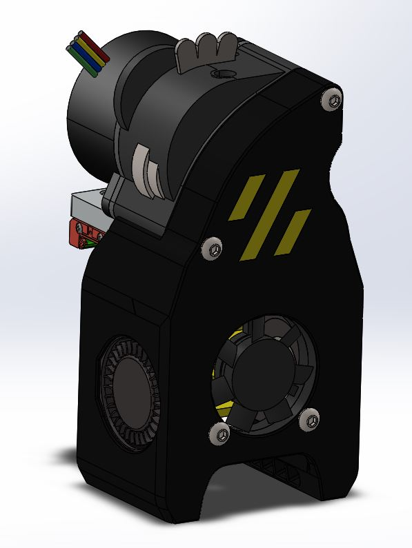
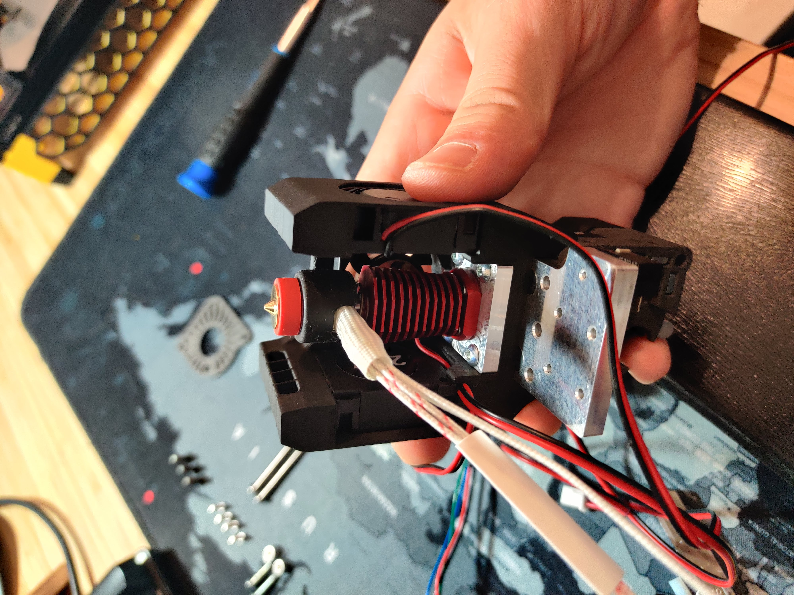
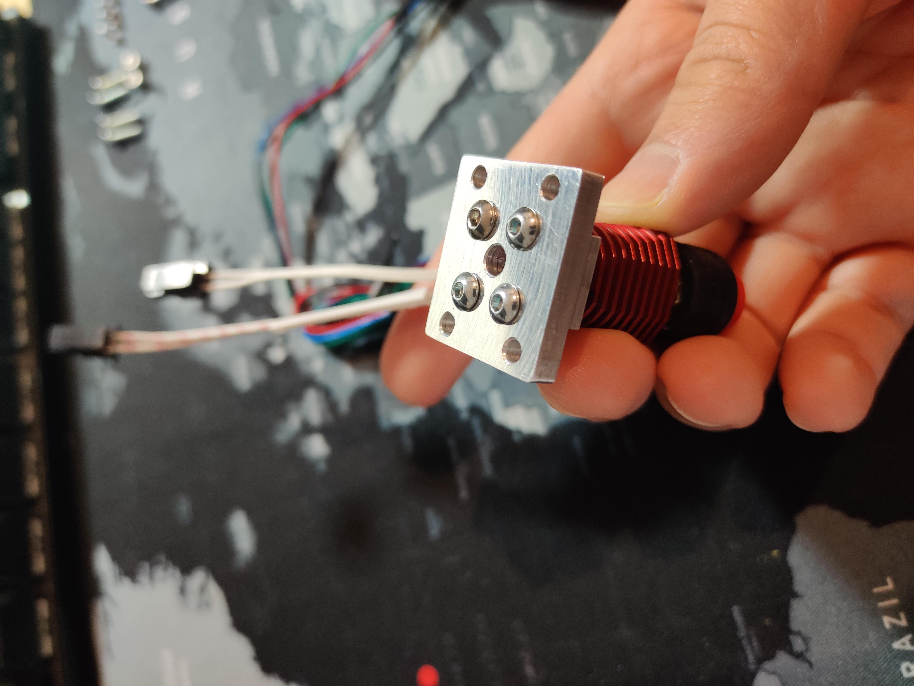
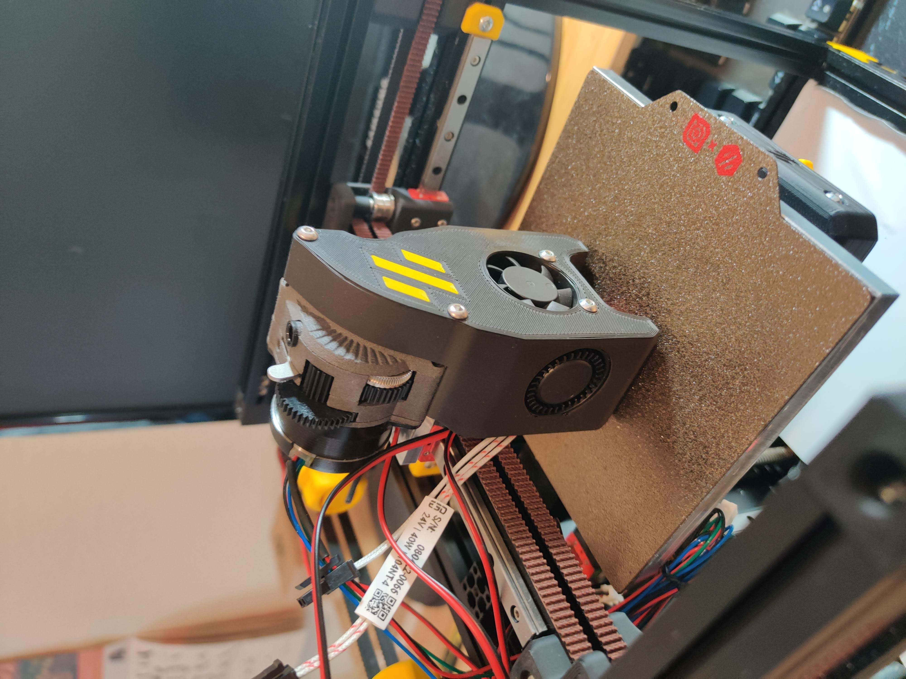
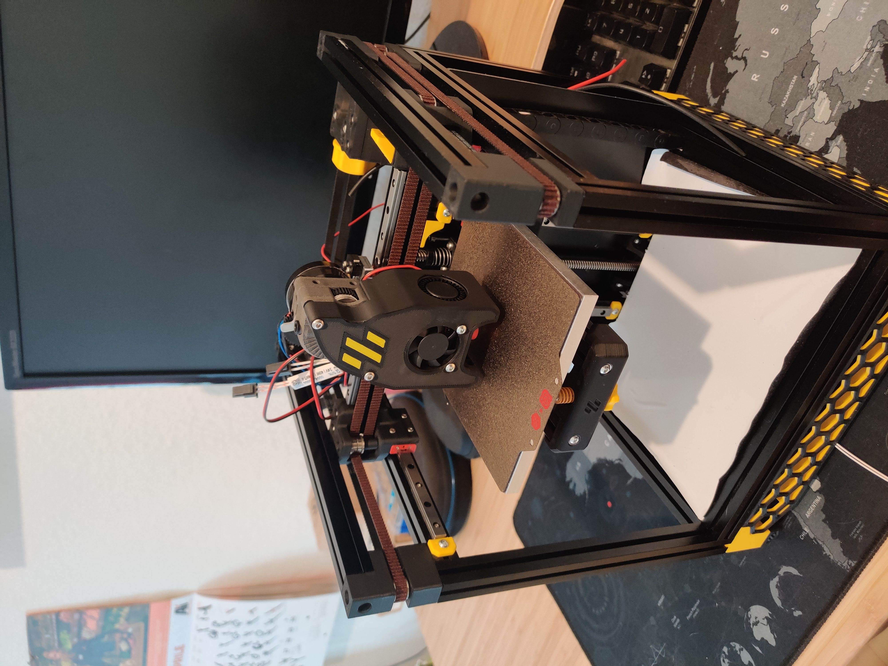

# Voron V0.1 Revo Aluminium Print Head

The print head has been redesigned with stiffness in mind. The main body is tight between two aluminum plates in order to make the all assembly very rigid.

## Printed part

There is only one printed part i.e. the LGXCoolingBody.STL that can be printed without supports.

In case it is not possible to machine the 2 aluminum plats there is a printable version of them available (not recommended). If you decide to go with the printed version you need four M3x4x5 threaded inserts.

## BOM

Item            | Quantity | 
----------------|----------|
ISO 4762 M2x6   | 6        |
ISO 4762 M3x8   | 4        |
ISO 7380 M3x45  | 2        |
ISO 7380 M3x12  | 6        |
ISO 10642 M3x10 | 7        |

## Pictures

## License

Shield: [![CC BY-NC-SA 4.0][cc-by-nc-sa-shield]][cc-by-nc-sa]

This work is licensed under a
[Creative Commons Attribution-NonCommercial-ShareAlike 4.0 International License][cc-by-nc-sa].

[![CC BY-NC-SA 4.0][cc-by-nc-sa-image]][cc-by-nc-sa]

[cc-by-nc-sa]: http://creativecommons.org/licenses/by-nc-sa/4.0/
[cc-by-nc-sa-image]: https://licensebuttons.net/l/by-nc-sa/4.0/88x31.png
[cc-by-nc-sa-shield]: https://img.shields.io/badge/License-CC%20BY--NC--SA%204.0-lightgrey.svg